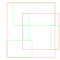
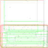

# ocaml-rtree

[Online Documentation](https://geocaml.github.io/ocaml-rtree/)

_This repository used to live at [mariusae/ocaml-rtree](https://github.com/mariusae/ocaml-rtree)
where most of the core implementation was done_.

This implements a simple rtree library according to [Guttman's original paper](http://www-db.deis.unibo.it/courses/SI-LS/papers/Gut84.pdf).
Currently node splitting is done through the quadratic algorithm in that paper.

[Some benchmarks are available too](./bench/README.md).

## Usage

There are two key elements to an rtree. The type of envelopes used and the type of the values being store in the tree.
These values must come with a function to calculate an envelope.

The core library comes with an implementation of envelopes as two-dimensional rectangles.

```ocaml
# #show_module Rtree.Rectangle;;
module Rectangle :
  sig
    type t
    val dimensions : int
    val compare_dim : int -> t -> t -> int
    val t : t Repr__Type.t
    val empty : t
    val intersects : t -> t -> bool
    val merge : t -> t -> t
    val merge_many : t list -> t
    val area : t -> float
    val contains : t -> t -> bool
    val coords : t -> float * float * float * float
    val v : x0:float -> y0:float -> x1:float -> y1:float -> t
  end
```

If you wanted to store lines in your rtree, one possible implementation might be the following.

```ocaml
module Line = struct
  type t = { p0 : float * float; p1 : float * float }

  let t =
    let open Repr in
    record "line" (fun p0 p1 -> { p0; p1 })
    |+ field "p0" (pair float float) (fun t -> t.p0)
    |+ field "p1" (pair float float) (fun t -> t.p1)
    |> sealr

  type envelope = Rtree.Rectangle.t

  let envelope { p0 = (x1, y1); p1 = (x2, y2) } =
    let x0 = Float.min x1 x2 in
    let x1 = Float.max x1 x2 in
    let y0 = Float.min y1 y2 in
    let y1 = Float.max y1 y2 in
    Rtree.Rectangle.v ~x0 ~y0 ~x1 ~y1
end

module R = Rtree.Make(Rtree.Rectangle)(Line)
```

### Insertion

To insert into an rtree, you simply pass a value into a pre-existing rtree. You can create an empty
rtree where you control the maximum node load size. This is essentially the branching factor in the
tree. The correct value is hard to guess.

```ocaml
# let index = R.empty 8;;
val index : R.t = <abstr>
# let index = R.insert index Line.{ p0 = (1., 2.); p1 = (3., 3.) };;
val index : R.t = <abstr>
# let index = R.insert index Line.{ p0 = (4., 4.); p1 = (5., 5.) };;
val index : R.t = <abstr>
```

#### Loading

If you have a list of values to put into an rtree, then you are better off using the `load` function instead
of folding and inserting. This uses the [OMT algorithm](https://ceur-ws.org/Vol-74/files/FORUM_18.pdf) and should give you a more optimised rtree layout.

```ocaml
# let lines =
    Line.[
      { p0 = (0., 0.); p1 = (1., 1.) };
      { p0 = (1., 1.); p1 = (2., 2.) };
      { p0 = (2., 2.); p1 = (3., 3.) };
      { p0 = (3., 3.); p1 = (4., 4.) };
    ]
  in
  let idx = R.load ~max_node_load:2 lines in
  print_endline (Repr.to_string R.t idx)
{"max_node_load":2,"tree":{"Node":[[[0,2,0,2],{"Leaf":[[[0,1,0,1],{"p0":[0,0],"p1":[1,1]}],[[1,2,1,2],{"p0":[1,1],"p1":[2,2]}]]}],[[2,4,2,4],{"Leaf":[[[2,3,2,3],{"p0":[2,2],"p1":[3,3]}],[[3,4,3,4],{"p0":[3,3],"p1":[4,4]}]]}]]}}
- : unit = ()
```

Also see [image.ml](./test/image.ml) for rendering an rtree with [vg](https://erratique.ch/software/vg).




### Find

Finding values requires you to pass in a search envelope. A list of result, perhaps empty, will be returned.

```ocaml
# R.find index (Rtree.Rectangle.v ~x0:0. ~y0:0. ~x1:3. ~y1:3.);;
- : Line.t list = [{Line.p0 = (1., 2.); p1 = (3., 3.)}]
# R.find index (Rtree.Rectangle.v ~x0:0. ~y0:0. ~x1:5. ~y1:5.);;
- : Line.t list =
[{Line.p0 = (4., 4.); p1 = (5., 5.)}; {Line.p0 = (1., 2.); p1 = (3., 3.)}]
```

### Repr

Rtree asks you to provide a runtime representation of your stored values, which allows you to persist your index easily.

```ocaml
# Fmt.pr "%a" (Repr.pp R.t) index;;
{"max_node_load":8,"tree":{"Leaf":[[[4,5,4,5],{"p0":[4,4],"p1":[5,5]}],[[1,3,2,3],{"p0":[1,2],"p1":[3,3]}]]}}
- : unit = ()
```
